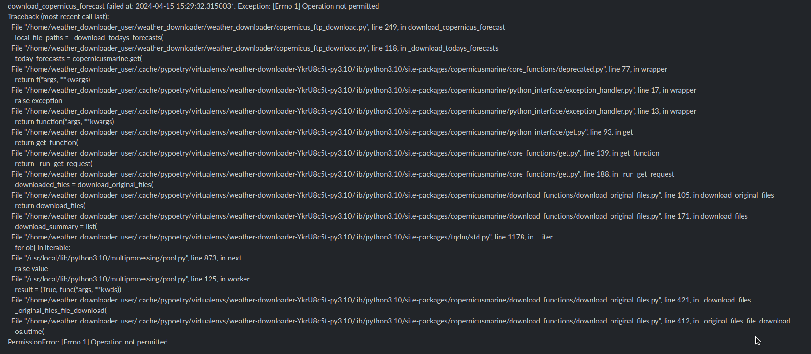

# Copernicus weather downloader - minimal example

This is a small example to try and reproduce an issue when downloading the copernicus forecast files.

The error happens when I download the copernicus forecast in a kubernetes pod.
The docker container runs as a non-root user.
The files are downloaded to an Azure Files drive mounted as a docker volume.

The error i get is the one below:





After some googling, i got to the conclusion that this happens because marinetoolbox is trying to change the "Last Modified Date" for the files, but it cannot do so on a folder for which it doesn't have root permissions.

An easy fix is to run the docker container as root. 

This is a fairly hard error to reproduce locally. 

To build the docker image: 

```
docker build -f Dockerfile_minimal -t copernicus_minimal:0.0.1 .
```

To get it up and running locally:

```
docker-compose -f docker-compose-copernicus.yml up
```